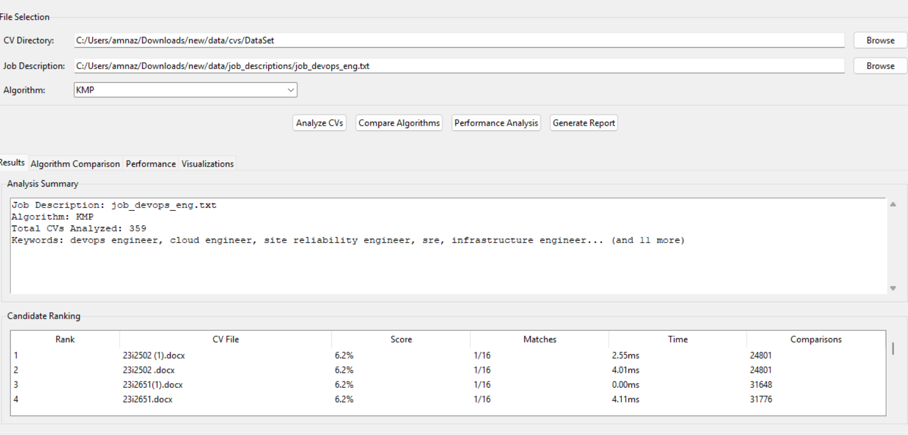
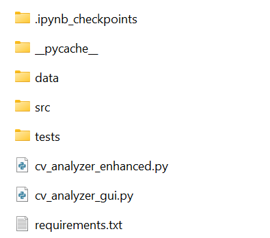
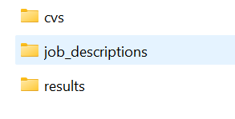
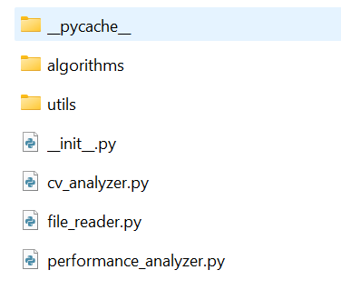
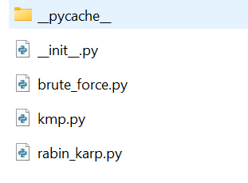
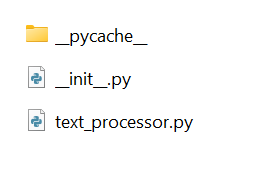

# Automated CV Analyzer & String Matching Comparison System

## 1.1 Problem Statement

Manual screening of CVs is a **time-consuming and subjective process** that often leads to inefficiencies in recruitment.
HR professionals typically spend **6–8 seconds per CV**, which increases the risk of overlooking qualified candidates due to **human fatigue and bias**.

This project aims to address these challenges by automating CV analysis using efficient string-matching algorithms.

---

## 1.2 Project Objectives

- Develop an **automated CV analysis system** capable of processing multiple CVs simultaneously
- Implement and compare **three string matching algorithms** for keyword detection
- Provide **quantitative scoring** for CV–job description matching
- Generate **performance metrics and visual comparisons** between algorithms
- Create an **intuitive desktop application** for end users



---

## How to Run the Project

### GUI-Based Application

1. Save all files as provided.
2. Run the following file:

   ```
   cv_analyzer_gui.py
   ```

3. Use the GUI to:

   - Upload CV files
   - Select a job description file
   - View matching scores and results

---

### Console-Based Execution

If you prefer a terminal-based output, run:

```
cv_analyzer_enhanced.py
```

This program:

- Executes all three string matching algorithms
- Displays **comparative results** between:

  - Brute Force
  - Knuth–Morris–Pratt (KMP)
  - Rabin–Karp

---

## Folder Hierarchy

### Level 1 Structure

As shown in image, the following folders should exist at the root level:

```
project-root/
├── data/
├── src/
├── tests/
```



---

### Data Folder Structure

Inside the `data` folder, create the following subfolders
(as shown in image):


```
data/
├── cvs/                 # Place CV files to be analyzed
├── job_descriptions/    # Contains .txt job description files
├── results/             # Stores output files after execution
```

---

### Source (`src`) Folder Structure

Create a `src` folder in the main branch

```
src/
├── algorithms/
├── utils/
```

(as shown in **`src-folder.png`**).


---

### Algorithms Folder

Inside the `algorithms` folder

- Brute Force string matching
- KMP string matching
- Rabin–Karp string matching
  (as shown in **`src-algorithms.png`**), place the algorithm implementation files:
  

---

### Utils Folder

Inside the `utils` folder
(place files as shown in the reference image):

- File handling utilities
- Preprocessing functions
- Result formatting and evaluation helpers
  

---

## String Matching Algorithms Used

- **Brute Force** – Simple baseline approach
- **Knuth–Morris–Pratt (KMP)** – Efficient prefix-based matching
- **Rabin–Karp** – Hash-based pattern matching

These algorithms are compared based on **accuracy and performance**.

---

## Notes

- Ensure CVs and job descriptions are placed in the correct folders before execution.
- Results will automatically be saved in the `data/results` directory.
